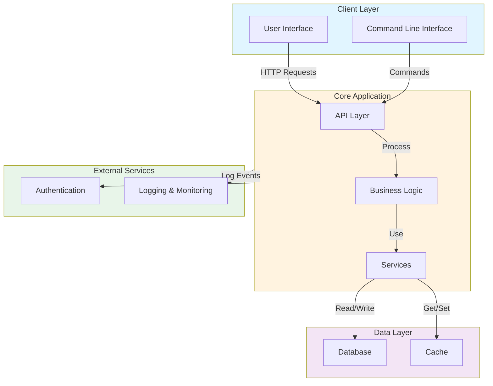

# Architecture Overview

This document provides a high-level overview of the lg project architecture.

## System Architecture

## Component Descriptions

### Client Layer
- **User Interface**: Web-based interface for end users
- **Command Line Interface**: CLI tools for automation and scripting

### Core Application
- **API Layer**: RESTful API endpoints and request handling
- **Business Logic**: Core application logic and algorithms
- **Services**: Domain-specific services and utilities

### Data Layer
- **Database**: Primary persistent data storage
- **Cache**: In-memory caching for performance optimization

### External Services
- **Authentication**: User authentication and authorization
- **Logging & Monitoring**: Application metrics and event logging

## Technology Stack

| Layer | Technologies |
|-------|--------------|
| Client | TBD |
| Backend | TBD |
| Database | TBD |
| Infrastructure | TBD |

## Data Flow

1. Requests enter through the Client Layer (UI or CLI)
2. API Layer validates and routes requests
3. Business Logic processes the request
4. Services interact with Data Layer
5. Results are cached for future requests
6. Response is returned to client

## Development Guidelines

- Follow the separation of concerns principle
- Maintain clear interfaces between layers
- Keep business logic independent of UI implementation
- Use dependency injection for loose coupling
- Implement proper error handling at each layer